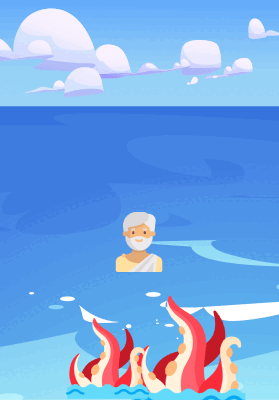
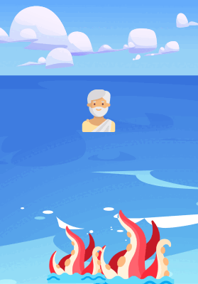

# Odysseus cast ashore ⛵

## About the Project 📚

A little game where the player has to help Odysseus get back to Ithaca while avoiding enemies such as cyclops, mermaids and witches.

## Screenshots 📷

  

## Technologies Used ⚛️ 

React v18

## Setup / Installation 💻

This project was bootstrapped with [Create React App](https://github.com/facebook/create-react-app).

In the project directory, you can run:
### `npm start`
Runs the app in the development mode.\
Open [http://localhost:3000](http://localhost:3000) to view it in your browser.

## Credits 📝

**Icons**

* [Ancient Greece icons created by Freepik - Flaticon](https://www.flaticon.com/packs/ancient-greece-18)

* [Fantastic Characters icons created by Freepik - Flaticon](https://www.flaticon.com/packs/fantastic-characters-12)

* [Greek Mythology icons created by Freepik - Flaticon](https://www.flaticon.com/packs/greek-mythology-55)

* [Kraken icons created by Freepik - Flaticon](https://www.flaticon.com/free-icons/kraken)

**Backgrounds**

* [Parallax background vector created by upklyak - www.freepik.com](https://www.freepik.com/vectors/parallax-background)

* [Greek mythology vector created by freepik - www.freepik.com](https://www.freepik.com/vectors/greek-mythology)

* [Print pattern vector created by macrovector - www.freepik.com](https://www.freepik.com/vectors/print-pattern)

* [Greek frame vector created by pikisuperstar - www.freepik.com](https://www.freepik.com/vectors/greek-frame)

**Intro music**

* [Mystical Harp Music - Dancers in the Fire - by Jonny Easton](https://www.youtube.com/watch?v=U3n9EQJ6YXs)

## Contributors 👭

* [giulialibralesso](https://github.com/giulialibralesso)

* [lidiaCirrone](https://github.com/lidiaCirrone)
